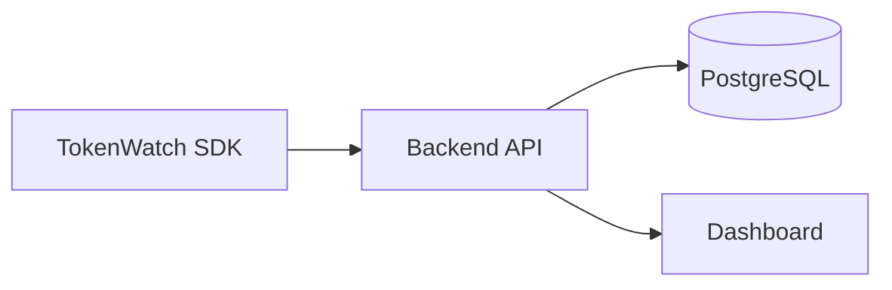
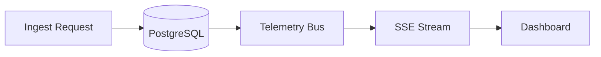
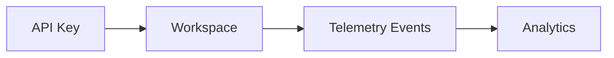

 # 🏗️ Architecture (TokenWatch)

## Architecture Overview

This document describes the runtime architecture, implemented flow, and engineering tradeoffs for the single-node beta deployment. It preserves implementation details and points to code locations for the primary components.

---

## Table of Contents

- [Architecture Overview](#architecture-overview)
- [System Components](#system-components)
- [End-to-End Request Lifecycle](#end-to-end-request-lifecycle)
- [Telemetry Flow (diagram)](#telemetry-flow-diagram)
- [Realtime Event Pipeline (diagram)](#realtime-event-pipeline-diagram)
- [Workspace Isolation (diagram)](#workspace-isolation-diagram)
- [Workspace isolation & auth](#workspace-isolation--auth)
- [Realtime model](#realtime-model)
- [Why PostgreSQL (tradeoffs)](#why-postgresql-tradeoffs)
- [Architecture Decisions](#architecture-decisions)
- [Engineering tradeoffs](#engineering-tradeoffs)
- [Scaling roadmap](#scaling-roadmap)
- [Safety & rate limiting](#safety--rate-limiting)
- [References and code pointers](#references-and-code-pointers)

---

## System Components

Summary of the primary components implemented in this repository.

| Component | Responsibility | Key Technologies |
|---|---|---|
| SDK | Buffering, batching, and delivering telemetry from application code | TypeScript (sdk/src), fetch/http POSTs |
| Backend API | Ingest endpoints, auth, workspace management, analytics, and realtime fanout | Node.js, Express, TypeScript (backend/src) |
| PostgreSQL | Durable storage for `requests` and analytics aggregates | PostgreSQL (backend/src/db), compatible with Neon |
| Dashboard | Workspace UI, SSE client, analytics views | React, Vite, React Query (frontend/src) |
| SSE Pipeline | Low-latency one-way delivery for workspace-scoped telemetry | Server-Sent Events, in-process `telemetryBus` EventEmitter |

---

## End-to-End Request Lifecycle

Describes the lifecycle for a telemetry event from SDK to dashboard update.

1. App calls `TokenWatch.track(...)` (SDK enqueues event).
2. SDK groups events into batches and POSTs to `POST /api/ingest` with `X-API-Key`.
3. `authenticateSDK` middleware validates the API key and sets `req.workspaceId`.
4. `ingestService` validates/normalizes payloads and writes rows into the `requests` table (single transaction for batches).
5. For each inserted row the service emits a `telemetry` event on `telemetryBus` and invalidates analytics caches for that workspace.
6. `realtimeStreamService` forwards `telemetry` events to connected SSE clients that requested that workspace (workspace-scoped subscriptions).
7. Frontend SSE handler receives rows and triggers selective query invalidation (React Query) so charts, lists and counters refresh with low latency.

---

## 📡 Telemetry Flow (diagram)

---

## ⚡ Realtime Event Pipeline (diagram)

---

## 🏢 Workspace Isolation (diagram)

---

## Workspace isolation & auth

- Ingest is authenticated using `X-API-Key`. Keys are stored and validated server-side; a successful key resolves a workspace and `req.workspaceId`.
- Dashboard sessions use JWT cookies for user authentication; `requireOwnedWorkspace` middleware enforces that API responses are scoped to the authenticated user's workspace.

> **Decision / Callout — Workspace model:** Workspace-scoped API keys ensure telemetry and analytics remain isolated per tenant; the dashboard enforces user→workspace ownership for data access.

---

## Realtime model

- We use SSE for one-way server→client updates. Each SSE connection is tied to a workspace and receives only that workspace's events.
- `telemetryBus` provides a simple in-memory fanout. This design is straightforward, low-latency, and easy to inspect in single-node setups.

> **Decision / Callout — SSE:** SSE was chosen for simplicity and firewall friendliness for one-way telemetry flows; it fits the low-latency dashboard use-case without bidirectional complexity.

---

## Why PostgreSQL (tradeoffs)

- Reason: managed durability, strong consistency, and compatibility with Neon/Heroku for production deployments.
- Tradeoffs: a single-node Postgres deployment still requires monitoring and backups. For higher ingest volume or multi-instance scaling, add a queue/pubsub layer and consider a dedicated analytics store.

> **Decision / Callout — PostgreSQL:** PostgreSQL is the primary datastore for requests and analytics. It provides durability and SQL-based aggregation capabilities useful for analytics.

---

## Architecture Decisions

> **Direct instrumentation instead of proxying traffic**

TokenWatch instruments applications directly via the SDK rather than proxying traffic. This preserves existing provider SDKs and request flows while enabling rich telemetry collection.

> **PostgreSQL as the primary datastore**

Postgres is used for requests, analytics aggregates, and operational durability. It is compatible with managed vendors (Neon) and fits the existing SQL-based analytics needs.

> **SSE instead of WebSockets**

SSE provides a simple, reliable one-way stream for dashboard updates and is less complex to operate for server→client telemetry delivery.

> **Workspace isolation model**

Workspace-scoped API keys and middleware resolve and enforce workspace boundaries for ingestion, storage, and streaming.

---

## Engineering tradeoffs

### Benefits

- Simple, observable single-node deployment path for beta and development.
- Low operational complexity: in-process fanout, SSE, and Postgres-oriented storage.
- SDK-first approach keeps integration low-friction for adopters.

### Limitations

- Single-node `telemetryBus` is not multi-instance friendly.
- High ingest volume may overwhelm a single Postgres instance without a buffering layer.

### Future scaling considerations

- Introduce a durable queue (Rabbit/Kafka/SQS) between ingest and DB for smoothing spikes.
- Move analytic workloads to a columnar/OLAP store or read-replica-based aggregation for heavy query loads.
- Replace in-process fanout with a distributed pub/sub (Redis Streams, NATS) for multi-instance SSE delivery.

---

## Scaling roadmap

1. Current architecture

	 - SDK → Express ingest → single PostgreSQL instance → in-process telemetryBus → SSE → Dashboard

2. Near-term options

	 - Add a durable queue ahead of the DB to buffer spikes and decouple ingest from persistence.
	 - Introduce read replicas or a dedicated analytics store for heavy queries.
	 - Swap `telemetryBus` to Redis Pub/Sub / Streams for multi-instance fanout.

3. Future distributed architecture considerations

	 - Use an event streaming backbone (Kafka/NATS) to deliver telemetry to multiple consumers (analytics, metrics, archival).
	 - Add a streaming analytics tier or columnar store for fast, large-scale analytics.

---

## Safety & rate limiting

- The ingest route applies a lightweight per-IP burst limiter to guard against accidental floods. This is a safety layer, not a replacement for API gateways, WAFs or upstream rate limiting.

---

## References and code pointers

- SDK: dependency‑free TypeScript client that buffers events in a bounded queue, groups them into batches, and delivers to the ingest API with retries and graceful shutdown support. See `sdk/src/transport.ts` and `sdk/src/client.ts`.
- Backend API: Express application that exposes auth, workspace management, analytics, requests, and ingest endpoints. Key services live in `backend/src/services`.
- Storage: single PostgreSQL database. Schema and initialization are in `backend/src/db`.
- Realtime: lightweight fanout using an in‑process `telemetryBus` EventEmitter and Server‑Sent Events (SSE) per workspace (`realtimeStreamService`).
- Frontend: React dashboard (Vite) that authorizes users, selects a workspace, opens an SSE connection to `/api/telemetry/stream`, and refreshes analytics views via React Query.

---

## Notes

- This document preserves the implemented architecture and references exact implementation locations in the repository. Do not change the runtime design without corresponding code changes.

