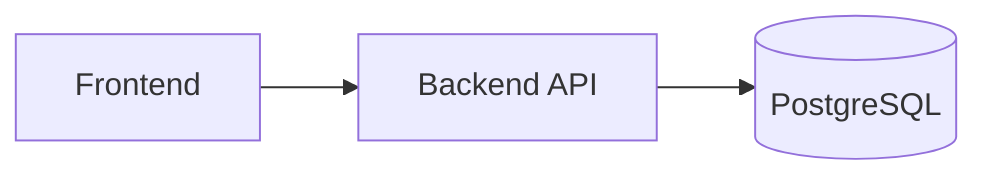
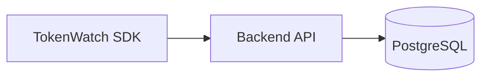
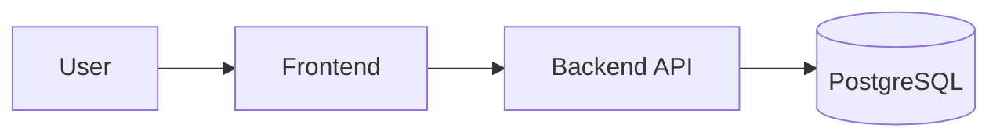

# 🚀 Deployment & Production checklist

Short, practical deployment notes for a single-node TokenWatch instance. This document reorganizes existing deployment instructions into a clearer, navigable guide while preserving every original command and operational detail.

---

## Table of Contents

- [Deployment Overview](#deployment-overview)
- [Deployment Components Summary](#deployment-components-summary)
- [Local Development Setup](#local-development-setup)
- [Environment Variables Reference](#environment-variables-reference)
- [Production Deployment Walkthrough](#production-deployment-walkthrough)
	- [Database setup](#database-setup)
	- [Backend deployment](#backend-deployment)
	- [Frontend deployment](#frontend-deployment)
	- [Configuration](#configuration)
	- [Validation](#validation)
- [Production Verification](#production-verification)
- [Backups & Retention](#backups--retention)
- [Security Callouts](#security-callouts)
- [Operational Notes & Scaling Considerations](#operational-notes--scaling-considerations)
- [Deployment Checklist](#deployment-checklist)
- [Mermaid Diagrams](#mermaid-diagrams)

---

## Deployment Overview

This section summarizes what is deployed and the responsibilities of each component.

- 🖥️ Frontend: Serves the dashboard UI. Points at the backend API URL. Responsible for workspace selection, displaying analytics and subscribing to SSE (`/api/telemetry/stream`).
- ⚙️ Backend: Exposes ingest, auth, workspace, analytics and realtime endpoints. Responsible for validating API keys, persisting telemetry to Postgres, emitting `telemetry` events, and serving SSE.
- 🗄️ Database: PostgreSQL stores `requests`, workspace data and aggregates. Schema and initialization live under `backend/src/db`.
- 📦 SDK: Lightweight TypeScript SDK used by applications to batch and send telemetry to the ingest API (`sdk/src`).

---

## Deployment Components Summary

| Component | Purpose | Deployment Target |
|---|---|---|
| Frontend | Dashboard UI; subscribes to SSE and shows analytics | static host / Vercel / Netlify or any static host (deploy separately) |
| Backend API | Ingest, auth, workspace, analytics, SSE endpoints | Node.js process (Express) |
| PostgreSQL | Persistent storage for requests and analytics | Managed Postgres (Neon/Heroku) or self-hosted Postgres |
| SDK | Instrumentation library shipped inside applications | Installed in application codebases |

---

## Local Development Setup

These instructions are copied verbatim from the original document to preserve exact commands.

- Backend: [http://localhost:3001](http://localhost:3001)
- Frontend: [http://localhost:5173](http://localhost:5173)
- SDK: points to the backend URL you are running locally

### Bash

```bash
cd backend
npm install
npm run dev

cd ../frontend
npm install
npm run dev
```

### PowerShell

```powershell
Set-Location backend
npm install
npm run dev

Set-Location ..\frontend
npm install
npm run dev
```

---

## Environment Variables Reference

Only variables documented in the repository are listed here. Do not invent variables.

| Variable | Required | Purpose |
|---|---:|---|
| `NODE_ENV` | Yes (production) | Node environment; set to `production` for production runs |
| `JWT_SECRET` | Yes (production) | Secret for signing dashboard JWT cookies; must be strong |
| `DATABASE_URL` | Yes (production) | Postgres connection string (Neon/Heroku compatible) |
| `PORT` | No | Backend listen port (default 3001) |
| `VITE_TOKENWATCH_API_URL` | Yes (frontend) | Frontend setting that points to deployed backend URL |
| `TELEMETRY_RETENTION_DAYS` | No | Controls retention dry-run and deletion behavior for `retention.js` |
| `TELEMETRY_RETENTION_APPLY` | No | When `true` the retention script will apply deletions (use with care) |
| `ENABLE_SIMULATORS` | No | Enable simulators in non-production/testing environments |
| `TOKENWATCHER_API_URL` | Yes (OpenClaw) | TokenWatcher backend URL for OpenClaw |
| `TOKENWATCHER_API_KEY` | Yes (OpenClaw) | Workspace-scoped API key of type `OPENCLAW` |
| `OPENCLAW_TELEGRAM_BOT_TOKEN` | Yes (OpenClaw) | Telegram bot token |

> Note: Copy `.env.example` → `.env` and populate these variables as required.

---

## Production Deployment Walkthrough

This section reorganizes existing hosted deployment notes into an ordered sequence. All commands are preserved exactly as in the original document.

### Database setup

- Set `DATABASE_URL` to your production Postgres connection string (Neon/Heroku Postgres).
- Use managed Postgres services or a self-hosted Postgres instance per your operational model.

### Backend deployment

- Set `NODE_ENV=production`.
- Set a strong `JWT_SECRET`.
- Store API keys server-side and keep them out of the browser bundle.

Start (production)

```bash
cd backend
npm ci
npm run build
NODE_ENV=production JWT_SECRET="<secret>" node dist/main.js
```

Health endpoint: `GET /api/health` — reports database connection status and operational counters (active SSE connections, simulators).

### Frontend deployment

- Build the frontend for production.
- Set `VITE_TOKENWATCH_API_URL` to your deployed backend URL.
- Deploy the frontend separately from the backend if needed.

### OpenClaw deployment

- Create an `OPENCLAW` key from Dashboard > Settings > API keys.
- Configure OpenClaw with only `TOKENWATCHER_API_URL`, `TOKENWATCHER_API_KEY`, and `OPENCLAW_TELEGRAM_BOT_TOKEN`.
- Do not deploy OpenClaw with dashboard user credentials or dashboard JWTs.

For existing workspaces, generate OpenClaw keys:

```bash
cd backend
npm run keys:create-openclaw
```

The command prints each new secret once. Store it in your deployment secret manager.

---

## Configuration

- Copy `.env.example` → `.env` and set values for production.
- Required in production: `NODE_ENV=production`, `JWT_SECRET` (strong, 32+ chars), `DATABASE_URL`.
- Recommended vars: `PORT` (default 3001), `TELEMETRY_RETENTION_DAYS` (optional)

---

## Validation

After deployment run the verification steps below to confirm core functionality.

---

## Production Verification

Organized verification steps derived from the existing instructions.

- Health checks
	- `GET /api/health` should report database connection status and operational counters.

- API verification
	- Ensure API key creation works.
	- Confirm `POST /api/ingest` accepts SDK events (use the SDK or curl with `X-API-Key`).

- Dashboard verification
	- Login works and a workspace is visible.
	- `VITE_TOKENWATCH_API_URL` is configured correctly in the deployed frontend.

- Telemetry verification
	- SDK can ingest events and dashboard receives data.
	- SSE stream connected and workspace-scoped events arrive in the UI.

Original short checklist (preserved):

- Login works
- Workspace visible
- API key creation works
- SDK can ingest events
- Dashboard receives data
- SSE stream connected

---

## Backups & Retention

Backups (preserved commands)

- Create a consistent PostgreSQL snapshot using the backup helper:

```bash
cd backend
node dist/scripts/backup.js
```

- Backups are saved to `backend/data/backups` by default — copy them to durable storage.

Retention (preserved commands)

- Dry-run:

```bash
TELEMETRY_RETENTION_DAYS=30 node dist/scripts/retention.js
```

- Apply deletions (EXTRA CARE):

```bash
TELEMETRY_RETENTION_DAYS=30 TELEMETRY_RETENTION_APPLY=true node dist/scripts/retention.js
```

Run retention during off-peak windows; retention is batched to avoid long locks.

---

## Security Callouts

- ⚠️ JWT secrets: Use a strong `JWT_SECRET` for production (`32+` characters recommended in existing docs).
- 🔐 API keys: Store API keys server-side and avoid bundling them into browser builds.
- ⚙️ Production configuration: Use `NODE_ENV=production` and keep backups and retention configured.

---

## Operational Notes & Scaling Considerations

- The ingest API has a per‑IP burst limiter for safety; tune client batching (`batchSize`, `flushInterval`) rather than disabling safeguards.
- Simulators: disabled in production by default. Enable via `ENABLE_SIMULATORS=true` only for controlled environments.
- When to scale beyond the current architecture: If sustained write traffic or analytic needs grow beyond single-node capabilities, introduce a queue and consider a more scalable Postgres deployment or a managed analytics store.

---

## Deployment Checklist

Convert the hosted checklist into an actionable checklist (items preserved):

- [ ] backend deployed
- [ ] frontend deployed
- [ ] `VITE_TOKENWATCH_API_URL` configured
- [ ] JWT secret configured
- [ ] backups configured
- [ ] retention policy configured

---

## Mermaid Diagrams

### Deployment Architecture



### Telemetry Ingestion



### Production Flow



## Notes

- This document preserves all original deployment commands and operational guidance. It reorganizes content for clarity and adds diagrams and checklists to improve navigation and verification.


