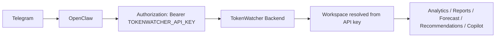

# OpenClaw Integration Audit

## Final Architecture

OpenClaw uses TokenWatcher API-key authentication only.



## Removed Architecture

OpenClaw must not use dashboard login, store JWTs, use dashboard user credentials, or supply a workspace selector.

## Required Environment

```text
TOKENWATCHER_API_URL=https://api.example.com
TOKENWATCHER_API_KEY=tw_oc_...
OPENCLAW_TELEGRAM_BOT_TOKEN=...
```

## Backend Contract

The backend validates the API key, verifies status/expiration/revocation, updates `last_used_at`, resolves the workspace and owner from the key, and enforces endpoint permissions.

OpenClaw keys receive:

- `workspace:read`
- `analytics:read`
- `requests:read`
- `reports:read`
- `recommendations:read`
- `forecast:read`
- `copilot:use`

SDK keys receive only:

- `telemetry:ingest`

## Migration

Run:

```powershell
cd backend
npm run keys:create-openclaw
```

The script creates one OpenClaw key per workspace and prints each secret once. Existing telemetry, SDK keys, users, and workspaces are not modified.
