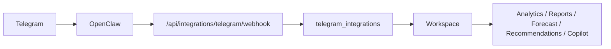

# OpenClaw Integration Audit

## Final Architecture

OpenClaw is stateless. Customer-specific bot tokens and OpenClaw API keys live only in `telegram_integrations`, encrypted at rest and scoped to the owning workspace.



## Runtime Rules

- OpenClaw host configuration is infrastructure-only.
- Dashboard users connect Telegram from Settings.
- TokenWatcher verifies the BotFather token, generates an OpenClaw API key for that workspace, stores both encrypted, and registers the webhook.
- Webhook requests are routed by `integrationId` and Telegram secret validation.
- Stored secrets are never returned to the dashboard after creation.

## Required Platform Environment

```text
TOKENWATCHER_API_URL=https://api.example.com
OPENCLAW_INTERNAL_SECRET=shared-platform-secret
TOKENWATCHER_SECRET_ENCRYPTION_KEY=shared-encryption-secret
OPENCLAW_PUBLIC_URL=https://openclaw.example.com
```

## Migration

Existing single-tenant OpenClaw deployments should remove customer-specific env vars and reconnect Telegram from each workspace dashboard. Existing telemetry, SDK keys, users, and workspaces are not modified.
