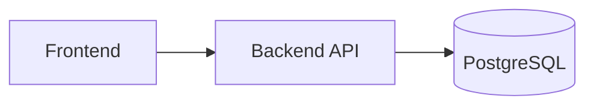
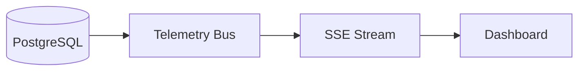
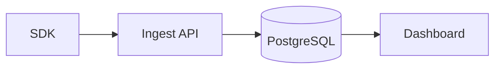

 # 🛠️ Operations

Operational handbook and runbook for TokenWatch. This document reorganizes existing operational notes, health checks, backups, retention, and troubleshooting guidance into a structured, navigable format. All original operational instructions and commands are preserved.

---

## Table of Contents

- [Operations Overview](#operations-overview)
- [Operations Components Summary](#operations-components-summary)
- [Health Checks](#health-checks)
- [Monitoring Recommendations](#monitoring-recommendations)
- [Backups & Recovery](#backups--recovery)
- [Retention Management](#retention-management)
- [SSE & Realtime](#sse--realtime)
- [Database Considerations](#database-considerations)
- [Troubleshooting Guide](#troubleshooting-guide)
	- [Backend issues](#backend-issues)
	- [Database issues](#database-issues)
	- [Dashboard issues](#dashboard-issues)
	- [SSE issues](#sse-issues)
	- [Telemetry ingestion issues](#telemetry-ingestion-issues)
- [Operational Best Practices](#operational-best-practices)
- [Production Maintenance Checklist](#production-maintenance-checklist)
- [Mermaid Diagrams](#mermaid-diagrams)

---

## Operations Overview

The frontend communicates with the backend API, which in turn reads and writes to PostgreSQL. Server-Sent Events (SSE) are used to stream workspace-scoped telemetry to the dashboard.

Key responsibilities:
- Frontend: display analytics, select workspace, and subscribe to SSE (`/api/telemetry/stream`).
- Backend: handle ingestion, auth, workspace management, analytics, SSE connections.
- Database: durable storage for `requests`, workspace data, and analytics aggregates.

---

## Operations Components Summary

| Component | Responsibility | Operational Concern |
|---|---|---|
| Frontend | Dashboard UI; subscribes to SSE and displays analytics | Ensure `VITE_TOKENWATCH_API_URL` points to backend; monitor frontend connectivity |
| Backend API | Ingest, auth, workspace, analytics, SSE endpoints | Monitor process, ensure `NODE_ENV=production`, `JWT_SECRET` set |
| PostgreSQL | Persistent storage for requests and aggregates | Backups, connection health, query latency |
| SSE Pipeline | In-process `telemetryBus` and SSE delivery | Monitor active connections and proxy timeouts |

---

## Health Checks

- Health endpoint: `GET /api/health` — inspect database connection status and operational counters (`activeSseConnections`, `activeSimulators`).
- Use the health endpoint as part of your monitoring and alerting to detect connectivity or resource problems.

---

## Monitoring Recommendations 📊

- Export health endpoint data and operational counters to your monitoring system for alerting on connection health, traffic spikes, and SSE connection counts.
- Monitor database connection pools and query latency to detect saturation early.

---

## Backups & Recovery 💾

Preserved backup command (do not modify):

```bash
node dist/scripts/backup.js
```

- `node dist/scripts/backup.js` uses `pg_dump` to create consistent SQL dumps saved to `backend/data/backups`. Copy snapshots to durable storage.

---

## Retention Management

Preserved retention commands (do not modify):

Dry-run:

```bash
TELEMETRY_RETENTION_DAYS=30 node dist/scripts/retention.js
```

Apply deletions (EXTRA CARE):

```bash
TELEMETRY_RETENTION_DAYS=30 TELEMETRY_RETENTION_APPLY=true node dist/scripts/retention.js
```

Run retention during off-peak windows; retention is batched to avoid long locks.

---

## SSE & Realtime ⚡

- SSE is one-way (server → client). Monitor the number of active connections and ensure load balancers and reverse proxies allow long‑lived connections and do not buffer.

---

## Database Considerations 🗄️

- For Postgres, ensure regular backups and monitor connection health. Use your provider's managed backup system and watch for query latency under load.

---

## Troubleshooting Guide 🚨

Organized troubleshooting steps derived from existing notes.

### Backend issues

- Backend unavailable: verify the backend service is running and reachable from the frontend.

### Database issues

- Monitor database connection health and backup cadence; for Postgres, use managed provider tooling to avoid long-term query or storage issues.

### Dashboard issues

- Wrong backend URL: the frontend will appear healthy but telemetry will never reach the backend.
- Empty dashboard: check the workspace selection and confirm data is being written to the expected workspace.

### SSE issues

- SSE disconnects: the stream reconnects automatically, but proxy timeouts or localhost restarts can interrupt it temporarily.
- If a reverse proxy is in front of the backend, make sure it does not buffer or terminate the SSE stream.

### Telemetry ingestion issues

- Invalid API keys: ingestion requests will fail authorization and events will not be stored.
- `429` from `/api/ingest` — indicates client burst limits; tune client batching or spread load.

---

## Operational Best Practices

- Tune client batching (`batchSize`, `flushInterval`) to avoid hitting client-side burst limits.
- Keep `ENABLE_SIMULATORS` disabled in production; enable only in controlled environments.

---

## Production Maintenance Checklist ✅

- [ ] Verify backend process is running and `GET /api/health` returns healthy
- [ ] Confirm Postgres backups are created and archived
- [ ] Validate frontend connectivity to backend (`VITE_TOKENWATCH_API_URL`)
- [ ] Ensure `JWT_SECRET` and other production env vars are set
- [ ] Check SSE connection counts and proxy timeouts

---

## Mermaid Diagrams

### System Connectivity



### SSE Realtime Flow



### Telemetry Lifecycle



---

## Notes

- This file preserves all original operational guidance, commands, and troubleshooting steps. Content has been reorganized and formatted for easier navigation and maintenance.

