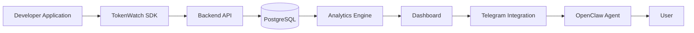

<p align="center">
  
</p>

<h1 align="center">TokenWatch</h1>

<p align="center">
  <em>Every request has a story.</em>
</p>

TokenWatch is a production telemetry, analytics, and Telegram delivery platform for AI applications.
It instruments your application directly, stores request telemetry in PostgreSQL, and turns raw usage data into dashboards, forecasts, reports, and Telegram replies.

## What problem it solves

Many AI products know their model invoices before they know their product behavior.
TokenWatch closes that gap by showing:

▪️ what each request costs
▪️ which models and endpoints are driving spend
▪️ how latency and errors change over time
▪️ what should be optimized next
▪️ how to surface the same data in Telegram

## Solution

TokenWatch keeps the instrumentation simple:

▪️ the SDK captures telemetry at the source
▪️ the backend authenticates, normalizes, and stores `requests`
▪️ the analytics engine derives dashboards, forecasts, reports, and recommendations from the same table
▪️ the dashboard and Telegram bot read the same workspace-scoped data
▪️ OpenClaw bridges Telegram traffic back to TokenWatch safely

## Key Features

▪️ workspace-isolated telemetry and analytics
▪️ bounded SDK queueing, batching, retries, and shutdown flush
▪️ live dashboard updates over SSE
▪️ request log search, filters, and exports
▪️ forecasts, reports, recommendations, anomalies, and Copilot tools
▪️ Telegram bot integration through BotFather and OpenClaw
▪️ production-ready auth, API keys, and secret handling

## Architecture Overview



The detailed system guide lives in [`docs/architecture.md`](docs/architecture.md).

## Technology Stack

| Layer | Stack |
|---|---|
| Backend | Node.js, Express, TypeScript, PostgreSQL |
| Frontend | React 18, Vite, React Query, Tailwind, shadcn/ui |
| SDK | TypeScript, fetch-based transport, bounded queue, retries |
| Telegram bridge | OpenClaw, Telegram Bot API |
| Realtime | Server-Sent Events |

## Folder Structure

| Folder | Responsibility |
|---|---|
| `backend/` | API, auth, ingest, analytics, storage, notifications |
| `frontend/` | Dashboard, settings, docs pages, charts, and SSE client |
| `sdk/` | Public telemetry SDK published to npm |
| `openclaw/` | Stateless Telegram bridge and intent router |
| `docs/` | Canonical product, platform, and contributor documentation |
| `backend/src/db/` | Database schema and startup schema application |

## Installation

Install the workspace packages you need:

```bash
cd backend
npm install

cd ../frontend
npm install

cd ../sdk
npm install

cd ../openclaw
npm install
```

## Environment Variables

The full environment matrix is documented in [`docs/deployment.md`](docs/deployment.md). The most important variables are:

| Component | Variables |
|---|---|
| Backend | `DATABASE_URL`, `JWT_SECRET`, `CORS_ORIGIN`, `TOKENWATCHER_SECRET_ENCRYPTION_KEY`, `OPENCLAW_INTERNAL_SECRET`, `OPENCLAW_PUBLIC_URL`, `RESEND_API_KEY`, `RESEND_FROM_EMAIL` |
| Frontend | `VITE_TOKENWATCH_API_URL` |
| OpenClaw | `TOKENWATCHER_API_URL`, `OPENCLAW_INTERNAL_SECRET`, `OPENCLAW_PORT`, `OPENCLAW_HOST`, `TOKENWATCHER_TIMEOUT_MS`, `TOKENWATCHER_USER_AGENT` |

## Running Locally

```bash
# Backend
cd backend
npm run dev

# Frontend
cd frontend
npm run dev

# OpenClaw
cd openclaw
npm run build
npm start
```

The backend listens on `http://localhost:3001` by default.
The frontend runs on Vite's dev server.
OpenClaw listens on `http://localhost:3300` by default.

## Running with Docker

No official Docker workflow is committed yet.
Use the local commands above or add Docker assets if your deployment strategy needs them.

## SDK Usage

```ts
import { TokenWatch } from "@zn_/tokenwatch";

TokenWatch.init({
  apiUrl: "http://localhost:3001",
  apiKey: process.env.TOKENWATCH_API_KEY!,
});

await TokenWatch.track("llm.request.completed", {
  route: "/api/chat",
  provider: "openai",
  model: "gpt-4o",
  input_tokens: 120,
  output_tokens: 80,
  cost_usd: 0.0042,
  latency_ms: 640,
});

await TokenWatch.flush();
```

The full SDK guide is in [`docs/sdk.md`](docs/sdk.md).

## Telemetry Flow

1. The developer application emits telemetry through the SDK.
2. The SDK batches and sends the payload to the backend ingest API.
3. The backend authenticates the workspace and stores telemetry in `requests`.
4. Analytics, forecasts, reports, and recommendations are derived from the same source table.
5. The dashboard refreshes through SSE and workspace-scoped queries.
6. Telegram and OpenClaw read the same workspace data to answer user requests.

See [`docs/architecture.md`](docs/architecture.md) for the full lifecycle.

## Dashboard Overview

The dashboard is documented in [`docs/frontend.md`](docs/frontend.md). The main screens are:

▪️ Overview
▪️ Requests
▪️ Models
▪️ Endpoints
▪️ Settings

Each screen is backed by the same telemetry source of truth.

## Telegram Integration

Telegram setup lives in [`docs/telegram.md`](docs/telegram.md).
In short:

▪️ create a bot in BotFather
▪️ paste the token into `Settings -> Telegram Integration`
▪️ connect the bot
▪️ send the bot one message
▪️ use Test to confirm delivery

## OpenClaw Integration

OpenClaw is the stateless Telegram bridge used by TokenWatch.
Read the guide in [`docs/openclaw.md`](docs/openclaw.md) for the webhook flow, intent routing, and tool execution model.

## Built with GPT-5.6 & Codex

TokenWatcher was developed and refined with the help of **GPT-5.6 and Codex** throughout the project lifecycle.

Codex served as an AI pair programmer, accelerating development by helping with:

- Debugging backend and frontend issues
- Refactoring TypeScript modules for better maintainability
- Implementing new features and production-ready workflows
- Resolving API integration and SDK issues
- Improving project architecture and code organization
- Generating and refining technical documentation
- Assisting with testing, code reviews, and optimization

During development, Codex was used across numerous engineering tasks, including production readiness audits, telemetry pipeline improvements, SDK stabilization, onboarding enhancements, Telegram integration, adapter verification, bug fixes, and documentation updates.

GPT-5.6 was also used to reason through architecture decisions, implementation strategies, debugging approaches, and feature planning, significantly accelerating the development of TokenWatcher while maintaining full developer oversight of the final implementation.

## Deployment

Deployment guidance is in [`docs/deployment.md`](docs/deployment.md).
It covers:

▪️ frontend deployment
▪️ backend deployment
▪️ OpenClaw deployment
▪️ database setup
▪️ production checklist

## Roadmap

▪️ more Telegram commands and richer conversational shortcuts
▪️ broader report export formats
▪️ deeper forecasting and recommendation surfaces
▪️ multi-instance realtime hardening
▪️ improved deployment automation and container support

## Contributing

Please read [`docs/contributing.md`](docs/contributing.md) before opening a pull request.

## License

MIT. The SDK package declares MIT in `sdk/package.json`.

## Acknowledgements

Built with the work of the TokenWatch maintainers and the open-source ecosystem behind Express, React, Vite, PostgreSQL, and Telegram Bot APIs.
