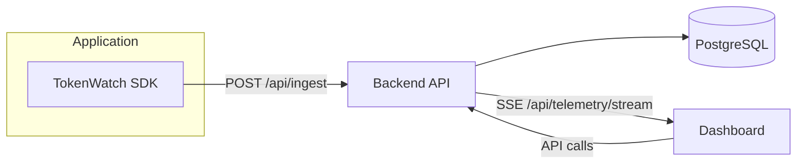

# TokenWatch

Lightweight AI telemetry, analytics, and cost monitoring for production systems.

<!-- Badges -->
[](https://github.com/ZainabTravadi/Token-Watcher-AI-API-Cost-Tracker/issues)
[](https://github.com/ZainabTravadi/Token-Watcher-AI-API-Cost-Tracker/actions)
[](https://www.npmjs.com/package/@zn_/tokenwatch)

---

## Feature highlights

- 🤖 AI: Integrates with model usage to capture requests, tokens, and costs.
- 📊 Analytics: Workspace-level dashboards, recent activity, and endpoints.
- 💰 Cost Monitoring: Per-model and per-request cost tracking and summaries.
- ⚡ Realtime Telemetry: SSE streaming for live dashboard updates.
- 🔑 API Keys: Workspace-scoped API keys with rotation guidance.
- 🛰️ Monitoring: Health checks, backups, and retention tooling.
- 🚀 Deployment: Deployment guides and Procfile for hosted deployments.
- 📦 SDK: Lightweight TypeScript SDK for easy instrumentation.
- 🏢 Workspaces: Isolated analytics per workspace for multi-tenant use.

---

## Technology stack

- TypeScript (backend, SDK, frontend)
- Node.js / npm
- Express (backend)
- React + Vite (frontend)
- PostgreSQL (Neon-compatible), SQLite (local development)
- Server-Sent Events (SSE) for realtime streaming
- Vitest for tests
- Heroku and Vercel deployment workflows

---

## Table of Contents

- [What is TokenWatch?](#what-is-tokenwatch)
- [How TokenWatch Works](#how-tokenwatch-works)
- [Feature highlights](#feature-highlights)
- [Quick Start](#5-minute-quick-start)
- [Installation](#installation)
- [API Key Lifecycle](#api-key-lifecycle)
- [Troubleshooting](#troubleshooting)
- [Deployment](#deployment)
- [Operations & maintenance (short)](#operations--maintenance-short)
- [Important directories](#-important-directories)
- [Next reading](#-next-reading)
- [Architecture](#architecture)
- [Getting help / community](#getting-help--community)
- [Contributing](#contributing)
- [Contributors](#-contributors)

---

## What is TokenWatch?

TokenWatch is a lightweight AI telemetry and cost monitoring platform.
It helps teams track token usage, model costs, latency, failures, and endpoint activity through a lightweight SDK and dashboard.

## Why TokenWatch?

Many tools require proxying AI traffic through a third-party service.
TokenWatch takes a different approach: instrument your application directly, keep provider integrations unchanged, retain control of request flow, and monitor usage through telemetry.

### TokenWatch vs Proxy-Based Monitoring

- TokenWatch instruments your app directly instead of forcing traffic through a proxy.
- Your provider SDKs stay unchanged, so you keep the integration patterns you already use.
- You keep control of request flow while still collecting telemetry for analytics and cost monitoring.

## How TokenWatch Works

- Backend: ingest API, analytics, authentication, and storage.
- Dashboard: workspaces, analytics, and realtime monitoring.
- SDK: telemetry collection, batching, and delivery.

This repository contains three main parts:
- `backend/` — TypeScript Express API, authentication, ingest pipeline, analytics, and SSE streaming backed by PostgreSQL (Neon-compatible).
- `frontend/` — React + Vite dashboard for workspace-level analytics, request logs and realtime updates.
- `sdk/` — Small, dependency‑free TypeScript SDK that batches and delivers telemetry to the ingest API.

 
## Architecture

A compact architecture diagram showing the main data flows. See the full [Architecture Guide](./ARCHITECTURE.md) for details.



The README below is a concise developer guide: quick start, core concepts, and where to look for implementation details.

## Workspace Lifecycle

- Signing up creates a default workspace automatically.
- Telemetry is isolated per workspace.
- Switching workspaces changes the analytics context in the dashboard.
- Deleting or changing workspaces affects what you can see in analytics and recent activity.

## API Key Lifecycle

- API keys are workspace-scoped.
- API keys authenticate telemetry ingestion.
- Rotating a key invalidates the previous key.
- SDK deployments must be updated after rotation.

> **Warning:** If you rotate an API key, update every deployed SDK instance that uses it before the old key is removed from service.

## Installation

```bash
npm install @zn_/tokenwatch
```

## Need credentials?

- Workspace ID
	- Dashboard → Sidebar → Copy Workspace ID
- API Key
	- Dashboard → Settings → API Keys
- apiUrl
	- Local: [http://localhost:3001](http://localhost:3001)
	- Hosted: your deployed backend URL

## 5-Minute Quick Start

1. Install the package.

```bash
npm install @zn_/tokenwatch
```

2. Initialize the SDK.

```js
import { TokenWatch } from "@zn_/tokenwatch";

TokenWatch.init({
	apiUrl: "http://localhost:3001",
	workspaceId: "ws_xxxxxxxx",
	apiKey: "tw_live_xxxxxxxx"
});
```

3. Send telemetry.

```js
await TokenWatch.track(
	"llm.request.completed",
	{
		route: "/api/chat",
		provider: "openai",
		model: "gpt-4o",
		input_tokens: 120,
		output_tokens: 80,
		cost_usd: 0.0042,
		latency_ms: 640
	}
);
```

4. Flush before exit.

```js
await TokenWatch.flush();
```

5. Verify in dashboard.

Look in **Overview**, **Recent Activity**, **Endpoints**, and **Models** after the first event lands.

### Expected Result

- ✓ Overview page updates
- ✓ Recent Activity shows a new row
- ✓ Endpoint appears in analytics
- ✓ Stream status shows connected

## Why flush() matters

> **Warning:** Telemetry is batched. Short-lived scripts and serverless functions may exit before queued events are delivered.

Always call:

```js
await TokenWatch.flush();
```

before shutdown.

## Troubleshooting

- No data appearing?
	1. Is backend running?
	2. Is `apiUrl` correct?
	3. Is `workspaceId` correct?
	4. Is API key valid?
	5. Did you call `flush()`?
	6. Are filters cleared?

- If events appear in the API but not the dashboard, verify the workspace selection in the sidebar and refresh the page.
- If the realtime stream disconnects, SSE reconnects automatically; localhost restarts can temporarily disconnect the stream.

## Deployment

See [Deployment Guide](./DEPLOYMENT.md) for local development commands, hosted deployment checklists, backups, and retention guidance.

### Frontend Deployment

The frontend should point at the backend API URL. The backend stores telemetry in PostgreSQL and exposes the ingest API for dashboard and SDK traffic.

- Local frontend example: use `http://localhost:3001` for the backend.
- Production frontend example: use your deployed backend URL.
- SSE endpoint requirement: `/api/telemetry/stream` must remain reachable for realtime dashboard updates.
- Reverse proxy consideration: avoid buffering SSE responses and preserve long-lived connections.

 ## What the system does (short)

 - SDK queues events in memory, batches them, and POSTs to `POST /api/ingest` with `X-API-Key`.
 - Backend authenticates the key, normalizes telemetry, writes the `requests` table in PostgreSQL, emits an event on `telemetryBus`, and invalidates analytics caches.
 - Frontend subscribes to `/api/telemetry/stream` (SSE) for workspace-scoped live rows and refreshes analytics views.

 ## Core features

 - Workspace isolation (API keys).
 - SDK batching, retries, and graceful shutdown (`flush()`).
 - Realtime SSE updates and cache invalidation for low-latency dashboards.
 - Opt-in retention and backup scripts for operational maintenance.

## 📁 Important directories

- [`backend/src/routes`](./backend/src/routes) — API routes and ingestion endpoints.
- [`backend/src/services`](./backend/src/services) — analytics, realtime streaming, ingestion, and workspace logic.
- [`backend/src/db`](./backend/src/db) — PostgreSQL schema, connection, and migrations.
- [`sdk/src`](./sdk/src) — SDK client, transport, batching, and runtime state.
- [`frontend/src/pages`](./frontend/src/pages) — dashboard pages and analytics views.
- [`frontend/src/components`](./frontend/src/components) — reusable UI and realtime dashboard components.

 ## Operations & maintenance (short)

 - Health endpoint: `GET /api/health` — returns database connection status and operational counters (active SSE connections, simulators).
 - Backups: `node dist/scripts/backup.js` uses `pg_dump` and saves SQL dumps to `backend/data/backups`.
 - Retention: `dist/scripts/retention.js` is dry-run by default. Use `TELEMETRY_RETENTION_APPLY=true` to delete.

## 📚 Next reading

- 🏗️ [Architecture Guide](./ARCHITECTURE.md) — runtime flow, ingest pipeline, SSE, and scaling tradeoffs.
- 🚀 [Deployment Guide](./DEPLOYMENT.md) — production setup, environment variables, backups, and retention.
- 🛠️ [Operations Guide](./OPS.md) — monitoring, maintenance, health checks, and operational workflows.
- 📦 [SDK Documentation](./sdk/README.md) — installation, examples, batching, retries, and production usage.

## Getting help / community

- Report bugs or request features: [Issues](https://github.com/ZainabTravadi/Token-Watcher-AI-API-Cost-Tracker/issues)
- Ask questions and discuss usage: [Discussions](https://github.com/ZainabTravadi/Token-Watcher-AI-API-Cost-Tracker/discussions)

> **Note:** When opening an issue, include reproduction steps and relevant logs to help triage quickly.

 ## Contributing

 - Use `NODE_ENV=production` and a strong `JWT_SECRET` for non-local deployments.
 - Keep workspace API keys secret and server-side; do not embed them in browser shipping code.

## 🤝 Contributors

Big thanks to everyone helping make **TokenWatch** better 🚀

<div align="center">

<a href="https://github.com/EvolutionX-10" title="@EvolutionX-10">
  
</a>

<br>

<a href="https://github.com/EvolutionX-10">
  <b>EvolutionX-10</b>
</a>

</div>

Every contribution - whether code, documentation, testing, or feedback—is greatly appreciated ❤️

