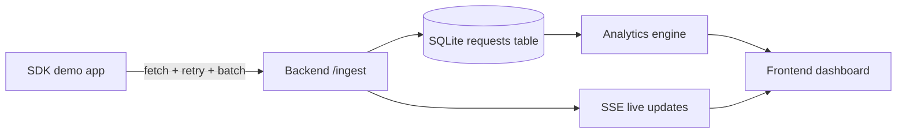

 # TokenWatch

> Lightweight developer observability for LLM request telemetry — simple SDK, single-node ingest, realtime dashboard.

This repository contains three parts:
- `backend/` — TypeScript Express API and SQLite storage (better-sqlite3)
- `frontend/` — React + Vite dashboard (workspaces, settings, realtime telemetry)
- `sdk/` — Lightweight client that batches and delivers telemetry to the ingest API

This README documents the actual implementation and runtime behavior (no marketing fluff). It is intended for engineers evaluating or operating TokenWatch.

## What TokenWatch is

TokenWatch captures LLM request telemetry (route, model, tokens, latency, cost, errors) per workspace, stores it in a local SQLite database, produces aggregate analytics, and streams live events to the dashboard via Server-Sent Events (SSE).

Core value:
- Minimal, auditable pipeline for early-stage projects and internal beta customers.
- SDKs batch and retry client-side to protect the ingest endpoint and the single-node SQLite datastore.

## Key features (real)
- Workspace isolation via API keys: `X-API-Key` authenticates ingest and is scoped to a workspace.
- Lightweight SDK that buffers events, groups them into batches, retries transient failures, and supports graceful shutdown/flush.
- Realtime updates via SSE from the backend to authenticated dashboard clients.
- Optional local simulators for demo/demo workspaces (enabled by default in development; disabled in production unless explicitly enabled).
- Opt-in retention and backup scripts for operational maintenance.

## Quick start (real)

1. Backend

```bash
cd backend
npm install
npm run build
NODE_ENV=development npm run dev
```

2. Frontend

```bash
cd frontend
npm install
npm run dev
```

3. SDK (example usage — see `sdk/README.md`)

```js
import * as TokenWatch from 'tokenwatch';

TokenWatch.init({ apiUrl: 'http://localhost:3001', workspaceId: 'ws_xxx', apiKey: 'tw_live_xxx' });
await TokenWatch.track('request.completed', { properties: { route: '/api/chat' } });
await TokenWatch.flush();
```

## Architecture & runtime flow (brief)

1. SDK enqueues events into a bounded in-memory queue. A transport flush timer groups events into batches (configurable `batchSize`, `flushInterval`) and POSTs to the backend ingest endpoint.
2. The backend `POST /api/ingest` authenticates with `X-API-Key` (hashed check in DB), normalizes and validates payloads, writes rows to the `requests` table in SQLite (WAL mode), emits events on `telemetryBus`, and invalidates analytics caches.
3. `telemetryBus` is a simple EventEmitter. `realtimeStreamService` subscribes clients to `telemetry` and `seeded` events and streams them over SSE to the dashboard.
4. Dashboard clients use `AuthContext` + `StatusContext`. When workspace is selected the UI opens an `EventSource` to `/api/telemetry/stream` (with cookie auth). Incoming SSE events trigger short debounced query invalidations to refresh analytics and request logs.

See `backend/src/routes` and `sdk/src` for implementation details.

## Operational notes (important)

- TokenWatch is intentionally a single-node, lightweight system. SQLite (WAL) is used for simplicity; expect practical limits. The ingest route implements an in-memory per-IP burst limiter to reduce write storms.
- Retention and backups are opt-in CLI scripts in `backend/src/scripts/`:
  - `dist/scripts/backup.js` — uses `better-sqlite3` backup API to create consistent DB snapshots.
  - `dist/scripts/retention.js` — batched deletes (dry-run by default).
- `/api/health` exposes `dbFiles` (main DB + WAL sizes) and operational counters: active SSE connections and active simulators. Use these for simple operational monitoring.

## Where to look next
- Backend auth & ingestion: `backend/src/routes/auth.ts`, `backend/src/routes/ingest.ts`, `backend/src/services/ingestService.ts`
- Realtime: `backend/src/services/realtimeStreamService.ts`, `backend/src/services/telemetryBus.ts`
- Simulator: `backend/src/services/workspaceSimulatorManager.ts`, `backend/src/services/simulatorService.ts`
- SDK: `sdk/src/transport.ts`, `sdk/src/client.ts`, `sdk/src/state.ts`, `sdk/src/generator.ts`

## Contributing & operations
- Keep production `NODE_ENV=production` and set a strong `JWT_SECRET`.
- Use `TELEMETRY_RETENTION_DAYS` and `TELEMETRY_RETENTION_APPLY=true` for scheduled retention runs.
- Regularly run the backup script and copy artifacts to durable storage.

----
For SDK-specific documentation, see `sdk/README.md`. For operational notes and deployment examples, see `DEPLOYMENT.md`.
# TokenWatch

TokenWatch is a simulated AI observability platform for tracking requests, token usage, latency, cost, and errors across LLM-powered endpoints. Day 1 ships with a Node.js + TypeScript backend, a React dashboard, SQLite persistence, and a live telemetry simulator so the UI feels active immediately without calling any real LLM APIs.

## Features

- Express + TypeScript backend
- SQLite persistence with automatic initialization
- Simulated telemetry for OpenAI and Anthropic providers
- Simulated models: `gpt-4o`, `gpt-4o-mini`, `claude-sonnet`, `claude-haiku`
- Realistic traffic patterns, spikes, daily trends, and occasional errors
- Live dashboard updates via polling and SSE
- Dynamic overview, endpoints, models, and request tables
- Health endpoint and CORS support
- Clean modular architecture for swapping in real providers later

## Architecture Overview

- `backend/src/core` handles app and server bootstrap.
- `backend/src/db` owns the SQLite singleton and schema initialization.
- `backend/src/services` contains telemetry generation, simulation, analytics aggregation, and repository logic.
- `backend/src/routes` exposes health, telemetry, requests, and analytics APIs.
- `frontend/src/lib/api.ts` is the single API client and React Query integration point.
- `frontend/src/pages` renders dashboard screens from backend data instead of local mock arrays.
- `frontend/src/components/AsyncState.tsx` provides loading and error states across the dashboard.
- `sdk/` contains the lightweight TokenWatch TypeScript SDK for browser and Node.js consumers.


## Setup

### 1. Install dependencies

```bash
cd backend
npm install
```

```bash
cd frontend
npm install
```

### 2. Run the backend

```bash
cd backend
npm run dev
```

Backend defaults:
- Server URL: `http://localhost:3001`
- API base path: `/api`
- SQLite database file: `backend/data/tokenwatch.sqlite`
```

## Quick Start

### 1. Install dependencies

```bash
cd backend
npm install
```

```bash
cd frontend
npm install
```

```bash
cd sdk
npm install
```

### 2. Start the backend

```bash
cd backend
npm run dev
```

By default, simulators are enabled in development and disabled outside development. To enable simulator startup in staging or production, set `ENABLE_SIMULATORS=true` before starting the backend.

The backend starts the demo SDK publisher automatically when simulators are enabled and exposes the ingest API at `http://localhost:3001/api/ingest`.

### 3. Start the frontend

```bash
cd frontend
npm run dev
```

### 4. Use the SDK

```ts
import { TokenWatch } from "tokenwatch";

TokenWatch.init({
  apiUrl: "http://localhost:3001",
  workspaceId: "ws_xxxxxxxx",
  apiKey: "tw_live_xxxxx"
});

TokenWatch.track("request.completed", {
  properties: { route: "/api/chat", status: 200 }
});

TokenWatch.simulate({
  provider: "openai",
  model: "gpt-4o",
  endpoint: "/api/chat"
});
```

## Integration Example

The SDK demo app in [sdk/examples/demo.ts](sdk/examples/demo.ts) is the same shape a customer app would use. It initializes the client, starts simulation, and sends events over `fetch` to the backend ingest API.

If you want to wire your own app, point `apiUrl` at the backend and send telemetry through `TokenWatch.init()` plus `TokenWatch.simulate()` or `TokenWatch.track()`.

### 3. Run the frontend

```bash
cd frontend
npm run dev
```

Frontend defaults:
- App URL: `http://localhost:8080`
- API URL: `http://localhost:3001`

If you need a different API origin, set:

```bash
VITE_TOKENWATCH_API_URL=http://localhost:3001
```

## Run Commands

### Backend

```bash
npm run dev
npm run build
npm run start
npm run seed
```

### Database maintenance

- Run retention dry-run (do not delete):

```bash
cd backend
TELEMETRY_RETENTION_DAYS=30 node dist/scripts/retention.js
```

- Apply retention (delete):

```bash
cd backend
TELEMETRY_RETENTION_DAYS=30 TELEMETRY_RETENTION_APPLY=true node dist/scripts/retention.js
```

- Create a timestamped backup (uses SQLite online backup API):

```bash
cd backend
node dist/scripts/backup.js
```

Backups are stored under `backend/data/backups` by default. The retention script is disabled unless `TELEMETRY_RETENTION_DAYS` is set; it performs batched deletes and defaults to a dry-run unless `TELEMETRY_RETENTION_APPLY=true` is provided.

### Frontend

```bash
npm run dev
npm run build
npm run preview
```

## Demo Screenshots

Add screenshots here when capturing the product demo.

- `docs/screenshots/overview.png`
- `docs/screenshots/endpoints.png`
- `docs/screenshots/models.png`
- `docs/screenshots/requests.png`
- `docs/screenshots/sdk-demo.png`
- `docs/screenshots/ingest-terminal.png`

## What You Should See

- A polished startup banner in the terminal with server URL, database status, simulated telemetry status, request count, and analytics summary.
- The dashboard loading real analytics from the backend instead of hardcoded arrays.
- Tables and charts refreshing as the simulator inserts new rows into SQLite.
- Visible live activity even on a fresh start because the backend seeds historical telemetry automatically.

## Future Roadmap

- Add real provider adapters for OpenAI and Anthropic behind the same repository interface.
- Add workspace-level filters, teams, and API key management.
- Add exports for CSV, JSON, and warehouse sinks.
- Add alerting rules and budget notifications.
- Add route-level drilldowns with longer historical windows.
- Add auth and multi-workspace support.
- Add production deployment configuration and observability for the backend itself.

## SDK

The `sdk/` folder now contains a standalone `tokenwatch` package with a Firebase-style surface:

```ts
import { TokenWatch } from "tokenwatch";

TokenWatch.init({
	apiUrl: "http://localhost:4000",
	workspaceId: "ws_xxxxxxxx",
	apiKey: "tw_live_xxxxx"
});

TokenWatch.simulate({
	provider: "openai",
	model: "gpt-4o",
	endpoint: "/api/chat"
});
```

It exposes `init()`, `track()`, `simulate()`, `startSimulation()`, `stopSimulation()`, `identify()`, and `setEndpoint()` with no runtime dependencies.
It also exposes `flush()` for graceful process shutdown and `stats()` for optional queue/retry visibility during development.
