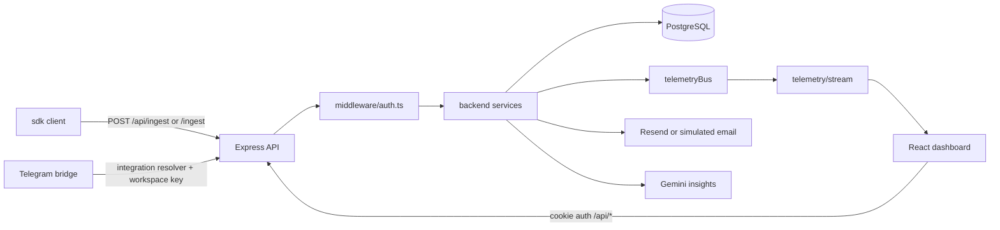

# Architecture

TokenWatch has four runtime parts: Express backend, React dashboard, dependency-free SDK, and OpenClaw Telegram bridge. The backend is the source of truth. The frontend and OpenClaw are API clients. The SDK is an ingest client.

## Layers

| Layer | Owns | Does not own |
|---|---|---|
| Routes | HTTP paths, parsing, auth middleware, response shape | SQL/business rules |
| Middleware | identity, permissions, workspace enforcement | analytics/report logic |
| Services | validation, normalization, SQL orchestration, side effects | Express response objects except SSE |
| Repository | `requests` SQL, analytics aggregations, exports | users/workspaces/API keys |
| Frontend API | fetch wrappers, query keys, shared types | page layout |
| Frontend pages | composition and page-local state | reusable fetch logic |
| SDK transport | queue, batch, retry, signing, shutdown | analytics meaning |

## Startup

Backend:

1. `backend/src/main.ts` calls `startServer()` in `backend/src/core/server.ts`.
2. `config/env.ts` loads `backend/.env`, validates `DATABASE_URL`, production `JWT_SECRET`, CORS, Resend, signed ingest.
3. `db/database.ts` applies `schema.ts` and idempotent ALTER updates.
4. Optional simulator and SDK demo start when enabled.
5. `core/app.ts` creates Express app, global middleware, security headers, CORS, routes.
6. `notificationService.startNotificationScheduler()` starts a 60-second loop.
7. Shutdown stops scheduler, simulators, SDK demo, HTTP server.

Frontend:

1. `main.tsx` renders `App`.
2. `App.tsx` installs QueryClient, AuthProvider, StatusProvider, routes.
3. `AuthContext` restores `/api/auth/me`.
4. `StatusContext` polls health and owns one SSE connection for the selected workspace.

SDK:

1. `init()` stores config in `state.ts` and configures `transport.ts`.
2. `track/identify/simulate` generate records.
3. Transport queues, batches, resolves workspace with `/api/me` if missing, signs, retries, flushes on shutdown.

OpenClaw:

1. `main.ts` loads infrastructure env only.
2. `server.ts` handles `/telegram/webhook/:integrationId`.
3. The backend resolver validates the Telegram secret against `telegram_integrations` and returns decrypted credentials for that request only.
4. `intentRouter.ts` maps text to a tool.
5. `tokenwatcher/tools.ts` calls TokenWatch API with the workspace OpenClaw key and `telegram/render.ts` formats replies.

## Lifecycles

### Telemetry Ingest

Files:

`sdk/src/client.ts` -> `sdk/src/generator.ts` -> `sdk/src/transport.ts` -> `sdk/src/security.ts` -> `backend/src/routes/ingest.ts` or `routes/requests.ts` -> `middleware/auth.ts` -> `ingestService.ts` -> `telemetryRepository.ts` -> `telemetryBus.ts` -> `notificationService.ts`.

Flow:

1. Record includes route/endpoint, provider, model, tokens, cost, latency, error, identity/properties.
2. SDK batches as `{ data: [...] }`.
3. Backend authenticates API key and optionally signature.
4. `validateTelemetryPayload()` accepts object, array, `{ data: [] }`, `{ requests: [] }`.
5. `ingestTelemetry()` normalizes, writes `requests`, emits SSE event, invalidates analytics cache, triggers alert evaluation asynchronously.

Tables: writes `requests`; reads/updates `api_keys`; reads `workspaces`; alert side effects may read/update `workspace_settings`.

### Authentication

Browser auth uses JWT cookie `tokenwatch_auth`, PBKDF2 password hashes, and `users.last_logout_at` invalidation.

API-key auth reads `X-API-Key` or typed bearer token. `verifyApiKey()` checks prefix, hash, revoked/expired state, stored type, permissions, workspace, then updates `last_used_at` at most once per minute.

Workspace access resolves workspace ID from params, query, body, or first workspace and verifies ownership unless API key already supplies workspace identity.

### Dashboard

Protected page -> `AuthContext` current workspace -> `lib/api.ts` query hook -> backend route -> React Query cache. `StatusContext` SSE invalidates `analytics-snapshot`, `telemetry-rows`, `request-log`, and `health`.

### Analytics

`routes/analytics.ts` enforces `analytics:read`; `analyticsService.ts` uses cache; `telemetryRepository.ts` queries `requests` and workspace budget. Ingest/workspace updates invalidate cache.

### Request Log and Export

`routes/requests.ts` parses filters, status, search, date/range, cursor/page, sorting. `telemetryRepository.listRequestLog()` and `listForExport()` own SQL. Exports support CSV/JSON/PDF with cap.

### Notifications

Settings route updates `workspace_settings`. Test email marks `email_verified=true`. Scheduler scans verified enabled settings each minute. Ingest triggers high-cost/error/latency alerts async and throttled. `emailService.ts` uses Resend or simulates outside production.

### Forecast, Reports, AI

Forecast derives from 14-day history buckets plus analytics snapshot. Reports combine analytics, recommendations, anomalies, efficiency, forecast, and Gemini summary/fallback. Copilot stores in-memory conversations, selects backend tools by regex, and uses Gemini grounded in tool outputs or deterministic fallback.

## Connection Graph

| A -> B | Why | Hidden dependency |
|---|---|---|
| `server.ts -> database.initialize` | schema before requests | PostgreSQL only |
| `app.ts -> routes/index.ts` | route mount points | prefixes affect all clients |
| `routes/* -> middleware/auth.ts` | protected API | workspace ID resolution |
| `middleware/auth.ts -> authService.verifyApiKey` | API key identity | prefix must match stored type |
| `sdk/security.ts -> backend/utils/sdkAuth.ts` | signed ingest | update together |
| `ingestService -> telemetryRepository` | persistence | `requests` shape |
| `ingestService -> telemetryBus -> realtimeStreamService -> StatusContext` | live dashboard | in-process only |
| `ingestService -> analyticsCache` | fresh analytics | cache otherwise hides writes |
| `ingestService -> notificationService` | alerts | async, best-effort |
| `forecast/report/intelligence/copilot -> analyticsService` | derived intelligence | snapshot windows matter |
| `OpenClaw server -> integrations resolver -> backend routes` | Telegram bridge | requires encrypted workspace integration credentials |
