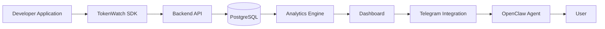

# Architecture

TokenWatch is built around one source of truth: the `requests` table.
Every dashboard metric, export, forecast, report, and recommendation is derived from that telemetry layer.

## Table Of Contents

- [System Overview](#system-overview)
- [Component Roles](#component-roles)
- [Request Lifecycle](#request-lifecycle)
- [Telemetry Lifecycle](#telemetry-lifecycle)
- [Analytics Pipeline](#analytics-pipeline)
- [Recommendation Pipeline](#recommendation-pipeline)
- [Telegram And OpenClaw Flow](#telegram-and-openclaw-flow)
- [Security Boundaries](#security-boundaries)

## System Overview

## Component Roles

| Component | Responsibility |
|---|---|
| Developer Application | Emits telemetry from the product code that actually calls AI providers |
| TokenWatch SDK | Batches events, resolves workspace identity, retries delivery, and flushes on shutdown |
| Backend API | Authenticates requests, validates telemetry, manages workspaces, and serves analytics |
| PostgreSQL | Stores users, workspaces, API keys, settings, and canonical telemetry rows |
| Analytics Engine | Builds metrics, charts, exports, forecasts, reports, and recommendations from `requests` |
| Dashboard | Displays analytics, request logs, settings, and live updates over SSE |
| Telegram Integration | Exposes analytics and reports in Telegram for workspace members |
| OpenClaw Agent | Stateless Telegram bridge that maps chat messages to TokenWatch tools |
| User | Interacts with the dashboard and Telegram bot |

## Request Lifecycle

1. The application calls `TokenWatch.track(...)` or emits another SDK event.
2. The SDK resolves workspace identity, queues the payload, and posts it to the ingest API.
3. The backend validates the API key and normalizes the payload.
4. The ingest service writes one or more rows into `requests`.
5. The backend emits a telemetry event and invalidates analytics caches for that workspace.
6. The dashboard receives live updates through SSE and refreshes visible data.

## Telemetry Lifecycle

▪️ The SDK is the producer.
▪️ The ingest API is the security boundary.
▪️ The `requests` table is the canonical store.
▪️ Analytics and exports read from the same rows rather than a separate shadow table.
▪️ Workspace filters are enforced everywhere analytics data leaves the backend.

## Analytics Pipeline

1. The dashboard or OpenClaw calls an analytics endpoint.
2. The backend reads the workspace-scoped request rows.
3. `telemetryRepository.ts` aggregates cost, latency, requests, tokens, provider mix, models, endpoints, and time buckets.
4. `analyticsService.ts` combines cached and realtime snapshots.
5. The frontend renders charts, KPIs, tables, and detail drawers.

## Recommendation Pipeline

1. The backend computes request patterns and aggregated health signals.
2. Recommendation services identify optimization opportunities from the same telemetry data.
3. Copilot and OpenClaw can ask for recommendations, forecasts, anomalies, or reports.
4. The dashboard shows the same guidance in the UI so users can act on it immediately.

## Telegram And OpenClaw Flow

1. A user sends a message to the Telegram bot.
2. Telegram delivers the update to OpenClaw.
3. OpenClaw resolves the Telegram integration through the TokenWatcher backend.
4. The backend returns the workspace-scoped bot credentials and OpenClaw key for that request.
5. OpenClaw maps the message to an intent such as Today’s Spend, Top Models, or Recommendations.
6. OpenClaw calls the matching TokenWatcher endpoint.
7. The response is rendered into a Telegram-friendly message and sent back to the user.

## Security Boundaries

▪️ Dashboard users authenticate with JWT cookies.
▪️ SDK and OpenClaw calls authenticate with API keys or signed requests.
▪️ Workspace isolation is enforced on every workspace-scoped route.
▪️ BotFather tokens are stored only as integration secrets and should never be shared.
▪️ OpenClaw uses an internal secret when asking the backend to resolve Telegram integrations.

## Related Docs

▪️ [`backend.md`](backend.md)
▪️ [`api.md`](api.md)
▪️ [`sdk.md`](sdk.md)
▪️ [`frontend.md`](frontend.md)
▪️ [`openclaw.md`](openclaw.md)
▪️ [`telegram.md`](telegram.md)
