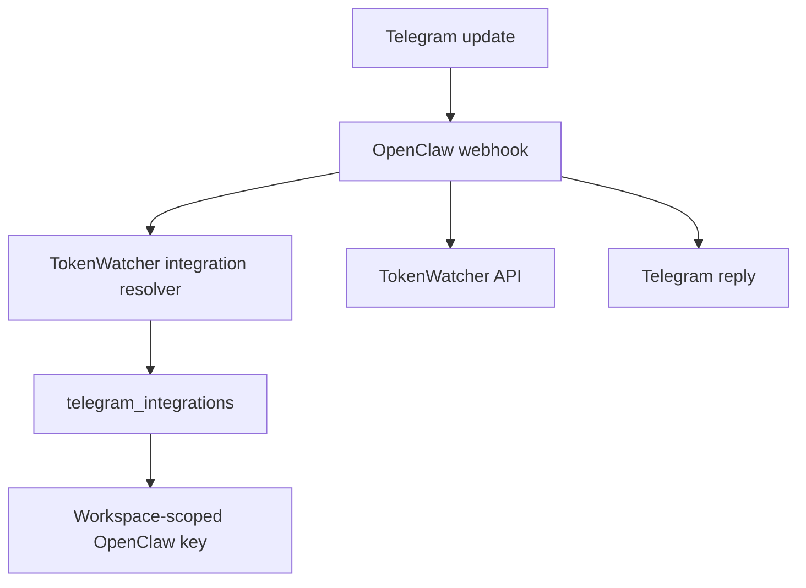

# OpenClaw

OpenClaw is the stateless Telegram bridge for TokenWatcher. It does not store customer bot tokens, workspace IDs, or TokenWatcher API keys in environment variables.

## Runtime Model



Each workspace connects its own Telegram bot from the TokenWatcher dashboard. TokenWatcher stores the bot token and OpenClaw key encrypted, then registers a webhook such as:

```text
POST /telegram/webhook/:integrationId
```

OpenClaw validates the Telegram secret through TokenWatcher, receives short-lived in-memory credentials for that request, calls TokenWatcher with the workspace OpenClaw key, and sends the Telegram reply with that workspace bot token.

## Configuration

OpenClaw needs only infrastructure configuration:

```bash
OPENCLAW_PORT=3300
OPENCLAW_HOST=0.0.0.0
OPENCLAW_LOG_LEVEL=info
TOKENWATCHER_API_URL=https://api.example.com
OPENCLAW_INTERNAL_SECRET=shared-platform-secret
TOKENWATCHER_TIMEOUT_MS=60000
```

Do not configure customer bot tokens or customer TokenWatcher API keys on the OpenClaw host.

## Local Commands

```bash
npm run build
npm start
```

Webhook URLs are created by the TokenWatcher dashboard when a user connects Telegram.
