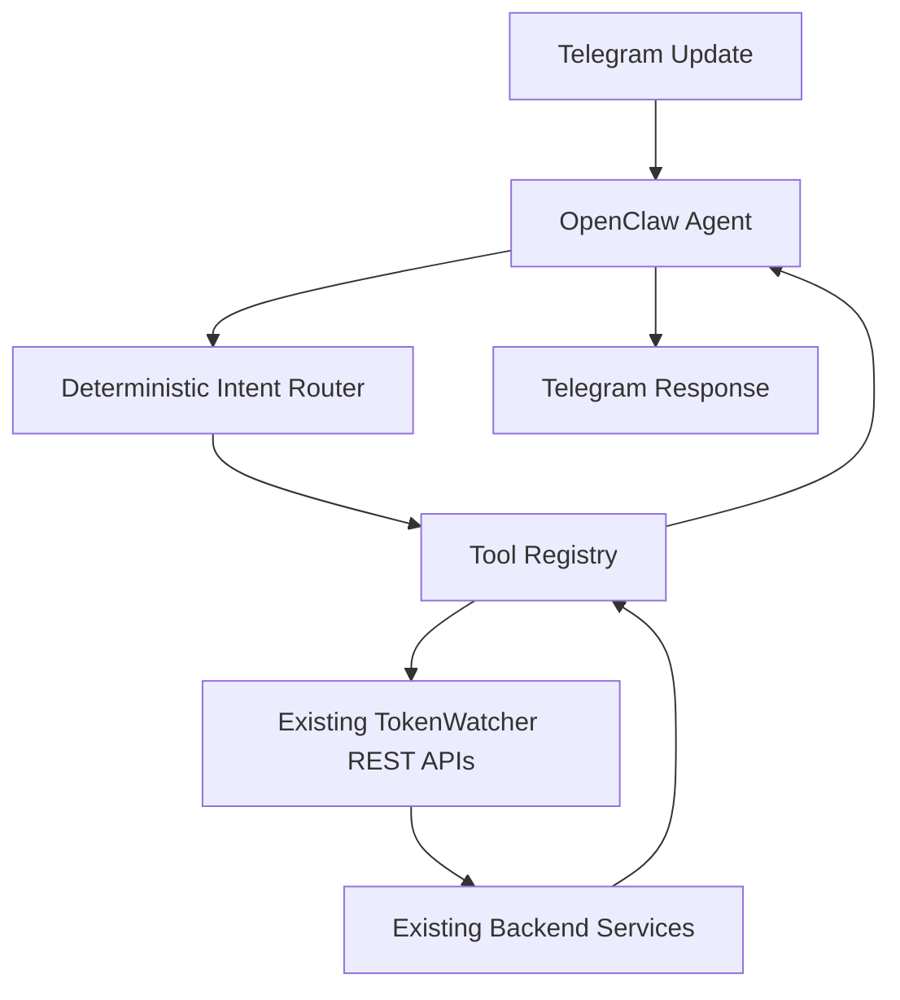

# OpenClaw Phase 3B

Phase 3B keeps the same lightweight OpenClaw service above the existing TokenWatcher backend. It does not duplicate analytics, forecast, reports, recommendations, or Copilot logic. Every tool wrapper calls an existing TokenWatcher REST endpoint.

## Architecture



## Phase 3B Scope

- Telegram webhook ingestion
- Deterministic keyword routing
- Hybrid routing to existing Copilot for complex questions
- Existing-auth TokenWatcher client
- Lightweight REST tool wrappers
- Structured JSON logging
- Graceful error handling
- Mobile-friendly Telegram summaries
- Verified demo flows for spend, forecast, requests, recommendations, reports, and Copilot reasoning

## Setup

1. Copy [`.env.example`](/C:/Users/DELL/Desktop/token-watcher/openclaw/.env.example) to `openclaw/.env`.
2. Fill in Telegram credentials and either service-account login credentials or a JWT.
3. Build the service:

```powershell
cd openclaw
npm run build
```

4. Start the service:

```powershell
cd openclaw
npm start
```

5. Point your Telegram webhook at:

```text
POST /telegram/webhook
```

## Supported Telegram Intents

- `today's spend` -> `/api/analytics/overview`
- `weekly spend` -> `/api/reports/weekly`
- `monthly spend` -> `/api/reports/monthly`
- `budget status` -> `/api/forecast/budget` + `/api/analytics/overview`
- `forecast` -> `/api/forecast`
- `recent requests` -> `/api/analytics/recent`
- `top models` -> `/api/analytics/models`
- `top endpoints` -> `/api/analytics/endpoints`
- `recommendation` -> `/api/intelligence/recommendations`
- `executive report` -> `/api/reports/executive`
- `infrastructure report` -> `/api/reports/infrastructure`
- `weekly report` -> `/api/reports/weekly`
- `monthly report` -> `/api/reports/monthly`
- `why`, `explain`, `spike`, `audit`, `reduce costs` -> `/api/copilot/chat`

## Verification

Run the mock smoke test:

```powershell
cd openclaw
npm run verify:phase3a
```

The verifier spins up a mock Telegram API and a contract-faithful mock TokenWatcher API, then exercises the real OpenClaw server end to end across the Phase 3B demo flows.

Run the live backend verification:

```powershell
cd openclaw
npm run verify:live
```

This path starts the real local TokenWatcher backend, creates a temporary user and workspace through the existing auth API, ingests real telemetry through the SDK, and then verifies OpenClaw end to end against PostgreSQL and Gemini-backed backend behavior.
